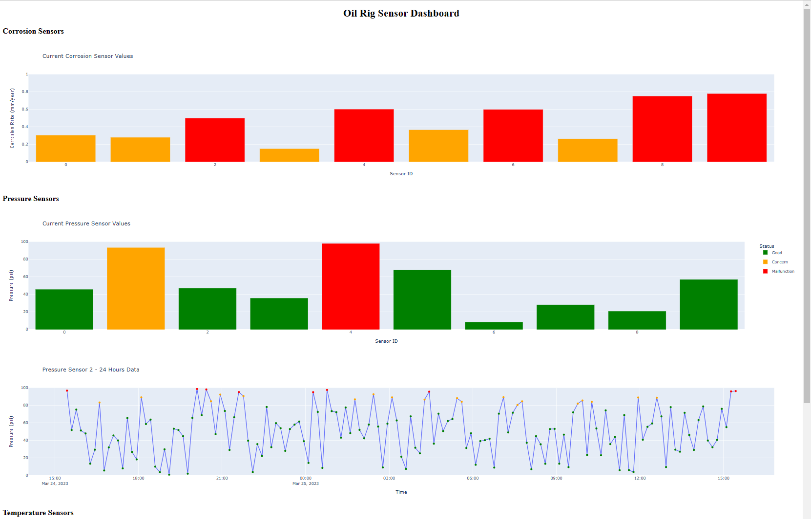

# RigMonitor Dashboard

This is a Python-based dashboard for monitoring various sensors in an oil rig environment. The dashboard is built using Dash, a web application framework for Python.

## Contact

## Sensor Categories and Ranges
The sensors on oil rigs are used to monitor various points in the drilling process, including pipes, casings, blowout preventers, and other equipment. The categories and ranges of sensors used on oil rigs are:

- Pressure sensors: 50-200, used to monitor various points in the drilling process, including pipes, casings, blowout preventers, and other equipment.
- Temperature sensors: 20-100, used to measure temperatures in different areas such as drilling fluids, pipes, and equipment.
- Flowmeters: 10-50, used to measure the flow rate of drilling fluids, oil, and gas.
- Acoustic sensors: 5-20, used for monitoring wellbore integrity, detecting leaks, and tracking the drilling process.
- Gas detectors: 10-50, used for detecting hazardous gases and ensuring safety.
- Vibration sensors: 10-50, used for monitoring equipment vibrations and preventing failures.
- Corrosion sensors: 5-20, used to monitor the integrity of pipes and equipment.
- Strain sensors: 10-50, used for measuring stress and strain on equipment.
- Downhole sensors: 5-20, depending on the complexity of the wellbore and the specific requirements of the drilling operation.
- Wireless sensor networks: The number of sensors in a wireless network can vary greatly, as it depends on the extent of the rig's monitoring and data collection needs.

## Contact:
oren.sternberg@icloud.com

## Date

3/24/2023

## GitHub

https://github.com/0r3ntal/RigMonitor

## Description

This dashboard allows the user to monitor the following sensor types:
- Corrosion
- Pressure
- Temperature
- Acoustic
- Flow Rate

The data for each sensor type is randomly generated using NumPy and displayed on the dashboard. The user can click on a sensor in the bar chart to see detailed data for the past 24 hours in a line chart.

## Installation

To run the dashboard, first clone the GitHub repository:

## Usage

To run the dashboard, execute the following command in the terminal:

Once the server is running, open a web browser and navigate to `http://127.0.0.1:8050/` to view the dashboard.

## Dependencies

The following packages are required to run the dashboard:
- Dash
- Plotly
- Pandas
- NumPy

These packages can be installed using pip by running the following command:

## Future Work

Future updates to this project could include:
- Modify to include realistic parameters and sensors configuration
- Fix flow rate sensor tag
- Adding more sensor types 
- Allowing users to specify custom time ranges for the detailed data view
- Enhancing the user interface with additional styling
- include flutter/dart version  

